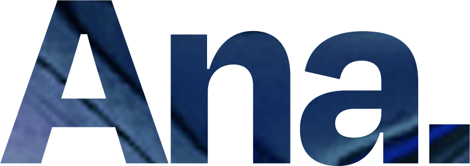

# 🎨 Holographic Portfolio - Analyce Ferreira

<div align="center">
  
  
  [](https://reactjs.org/)
  [](https://www.typescriptlang.org/)
  [](https://vitejs.dev/)
  [](https://styled-components.com/)
  [](https://threejs.org/)
</div>

## 📖 Sobre o Projeto

Portfolio pessoal interativo e moderno desenvolvido com tecnologias de ponta, apresentando um design holográfico único e experiências 3D imersivas. O projeto demonstra habilidades em desenvolvimento frontend, design de interface e criação de experiências visuais inovadoras.

## ✨ Características

- 🎭 **Design Holográfico**: Interface com efeitos visuais futuristas e gradientes holográficos
- 🚀 **Performance Otimizada**: Construído com Vite para desenvolvimento rápido e builds eficientes
- 🎨 **Componentes Reutilizáveis**: Arquitetura modular com componentes React bem estruturados
- 📱 **Responsivo**: Design adaptável para todos os dispositivos
- 🌟 **Animações Fluidas**: Transições suaves com Framer Motion
- 🎮 **Experiências 3D**: Cenas interativas com Three.js e React Three Fiber
- 🎯 **TypeScript**: Código tipado para maior confiabilidade e manutenibilidade

## 🛠️ Tecnologias Utilizadas

### Frontend

- **React 18.2.0** - Biblioteca para interfaces de usuário
- **TypeScript 4.7** - Superset JavaScript com tipagem estática
- **Vite 3.2.3** - Build tool e dev server ultra-rápido
- **Styled Components 5.3.6** - CSS-in-JS para estilização

### Gráficos 3D e Animações

- **Three.js 0.147.0** - Biblioteca 3D para web
- **React Three Fiber 8.0.11** - Renderizador React para Three.js
- **React Three Drei 9.4.2** - Utilitários para React Three Fiber
- **Framer Motion 11.0.14** - Biblioteca de animações
- **Spline Tool** - Ferramentas para criação de experiências 3D

### Utilitários

- **React Icons 5.0.1** - Ícones populares para React
- **React Intersection Observer 9.8.1** - Detecção de elementos visíveis
- **Maath 0.5.2** - Matemática para gráficos 3D

## 🚀 Como Executar

### Pré-requisitos

- Node.js (versão 16 ou superior)
- npm ou yarn

### Instalação

1. **Clone o repositório**

   ```bash
   git clone https://github.com/seu-usuario/holo-portfolio.git
   cd holo-portfolio
   ```

2. **Instale as dependências**

   ```bash
   npm install
   # ou
   yarn install
   ```

3. **Execute em modo de desenvolvimento**

   ```bash
   npm run dev
   # ou
   yarn dev
   ```

4. **Abra no navegador**
   ```
   http://localhost:5173
   ```

### Scripts Disponíveis

- `npm run dev` - Inicia o servidor de desenvolvimento
- `npm run build` - Gera build de produção
- `npm run preview` - Visualiza o build de produção
- `npm run deploy` - Faz deploy para GitHub Pages

## 📁 Estrutura do Projeto

```
holo-portfolio/
├── public/                 # Arquivos estáticos
│   ├── images/            # Imagens do projeto
│   ├── assets/            # Assets SVG e outros
│   ├── lottieJson/        # Animações Lottie
│   └── portfolio-assets/  # Imagens do portfolio
├── src/
│   ├── App/               # Componente principal da aplicação
│   ├── components/        # Componentes reutilizáveis
│   │   ├── Hero/         # Seção hero com cena 3D
│   │   ├── About/        # Seção sobre
│   │   ├── Portfolio/    # Seção de projetos
│   │   ├── Contact/      # Formulário de contato
│   │   ├── Techs/        # Tecnologias utilizadas
│   │   ├── Menu/         # Menu de navegação
│   │   └── Footer/       # Rodapé
│   ├── screens/          # Telas da aplicação
│   ├── styles/           # Estilos globais e temas
│   └── assets/           # Fontes e outros recursos
├── package.json           # Dependências e scripts
├── vite.config.js         # Configuração do Vite
└── tsconfig.json          # Configuração do TypeScript
```

## 🎨 Componentes Principais

### Hero Section

- Cena 3D interativa com Three.js
- Animações de entrada impactantes
- Design holográfico com gradientes

### Portfolio

- Galeria de projetos com modal de visualização
- Layout responsivo e organizado
- Filtros por categoria de projeto

### About

- Informações profissionais
- Habilidades técnicas
- Experiência em design e desenvolvimento

### Techs

- Lista de tecnologias dominadas
- Ícones e descrições
- Layout em grid responsivo

## 🌐 Deploy

O projeto está configurado para deploy automático no GitHub Pages através do script `npm run deploy`.

## 📱 Responsividade

O portfolio é totalmente responsivo e funciona perfeitamente em:

- Desktop (1920px+)
- Tablet (768px - 1024px)
- Mobile (320px - 767px)

## 🎯 Funcionalidades

- [x] Navegação suave entre seções
- [x] Animações de scroll
- [x] Cenas 3D interativas
- [x] Formulário de contato funcional
- [x] Galeria de projetos
- [x] Design responsivo
- [x] Tema escuro/claro
- [x] Otimização de performance

## 🤝 Contribuindo

1. Faça um fork do projeto
2. Crie uma branch para sua feature (`git checkout -b feature/AmazingFeature`)
3. Commit suas mudanças (`git commit -m 'Add some AmazingFeature'`)
4. Push para a branch (`git push origin feature/AmazingFeature`)
5. Abra um Pull Request

## 📄 Licença

Este projeto está sob a licença MIT. Veja o arquivo [LICENSE](LICENSE) para mais detalhes.

## 👩‍💻 Sobre a Desenvolvedora

**Analyce Ferreira** - Desenvolvedora Full Stack e Designer UI/UX

- 🎨 Especialista em design de interfaces
- 💻 Desenvolvedora React/React Native
- 🚀 Apaixonada por experiências digitais inovadoras
- 🌟 Criadora de soluções criativas e funcionais

## 📞 Contato

- **Portfolio**: [Link do Portfolio](https://seu-portfolio.com)
- **LinkedIn**: [Analyce Ferreira](https://linkedin.com/in/analyce-ferreira)
- **GitHub**: [@seu-usuario](https://github.com/seu-usuario)

---

<div align="center">
  <p>Feito com ❤️ por <strong>Analyce Ferreira</strong></p>
  <p>⭐ Se este projeto te ajudou, considere dar uma estrela!</p>
</div>
